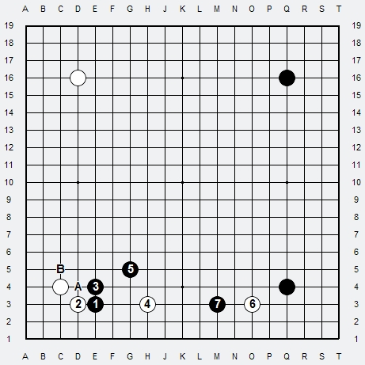
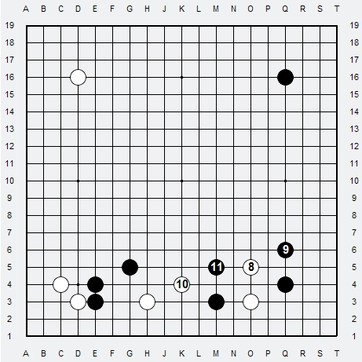
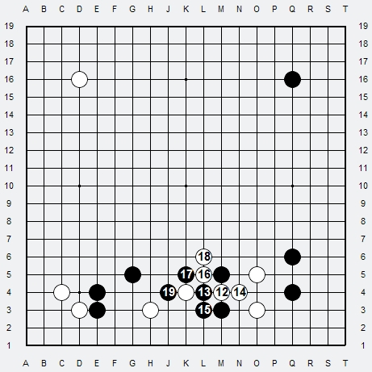
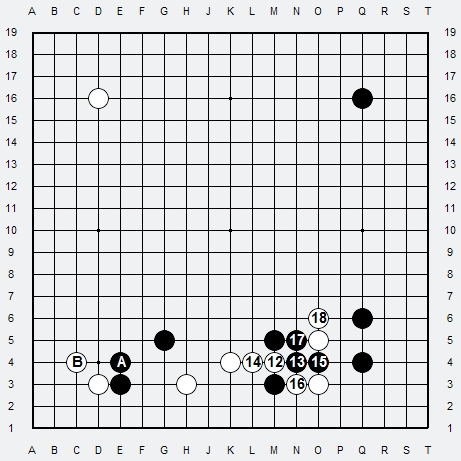
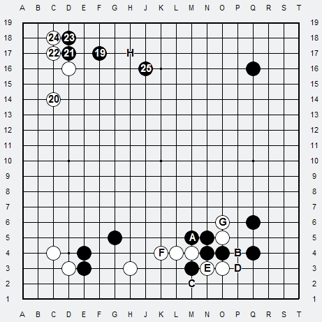
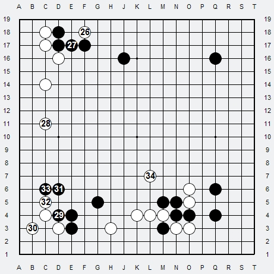
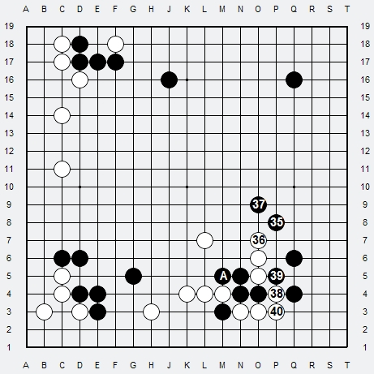

# Ex.1 Groupes faibles

1. Noir approche le Komoku Sud blanc en Keima
2. Blanc joue contact Tsuke (ce coup est mauvais car il renforce inutilement Noir)
3. Noir répond classiquement Nobi
4. Blanc pince de suite Noir (tres mauvais ! Blanc n'a pas de base de vie, Noir peut appuyer En A et couvrir Blanc Ouest)
5. Noir sort en Keima
6. Blanc approche le Hoshi Sud-Est en Keima
7. Noir double pince Blanc (pincer en L3 aurait été plus efficace sur les deux pierres blanches 4 & 6 à la fois)

A Blanc de jouer. L'échange est déjà catastrophique pour Blanc. En ignorant la plus élémentaire règle il a maintenant 3 groupes faibles sans base de vie, (2, 4 et 6). Déjà Blanc a 3 problèmes à résoudre alors qu'il ne peut poser qu'une seule pierre a la fois !

8. Blanc sort en Tobi
9. Noir stabilise haut son bord en Tobi (pour maintenir la pression sur Blanc)
10. Blanc outside move en Keima
11. Noir coupe et suit en Tobi

QUESTION : Si Blanc joue Warikomi en M4 (jouer entre deux pierres), peut-il couper le Tobi Noir 11 ?

RÉPONSE : Non, a cause de la faiblesse de la pierre blanche 10.

***

12. Blanc joue Warikomi
13. Noir atari (si Blanc ne répond pas, Noir mange et connecte en maintenant la séparation de Blanc)
14. Blanc sort sa pierre 12
15. Noir connecte par le bord
16. Blanc coupe par le haut
17. Noir atari et menace la pierre de coupe D
18. Blanc sort sa pierre de coupe D
19. Noir tue la pierre blanche en descendant jusqu'en bas si nécessaire

Noir a donné une pierre au Tobi Blanc, mais a maintenu la coupe, tue le Keima blanc et prend le bord Sud. 

Malheureusement Noir répond de l'autre coté, et cela change tout !

13. Noir atari sur le Warikomi
14. Blanc sort sa pierre 12
15. Noir traverse le Tobi blanc
16. Blanc coupe
17. Noir connecte par le haut
18. Blanc sort sa pierre dessus vers le Centre

A Noir de jouer. Blanc B et Noir A n'ont toujours pas de base de vie !

QUESTION : Qui meurt, qui vit ?

RÉPONSE :
- Noir A a peu de libertés, et Blanc peut le couper a tout moment en B et tuer Noir A.
- Blanc E a aussi peu de libertés, si Blanc coupe en B, Noir répond D.
Noir descend en C, il aura ainsi des possibilités de tuer entièrement Blanc Sud !
- Si Blanc E meurt, Blanc Sud F meurt car pas assez de place pour faire 2 yeux sur place. Le Sud sera à Noir, le groupe Blanc G restera flottant.

***

C'est a Noir de jouer. Bien possible que Blanc E meurt avant Noir A si Noir joue maintenant C, mais il joue ailleurs,
et ne règle aucun problème au Sud, ni pour son groupe A ni pour son groupe Sud-Ouest sans base de vie !

19. Noir joue Keima au Nord
20. Blanc verouille le coin en Keima
21. Noir joue Tsuke au contact
22. Blanc bloque
23. Noir descend (pas joseki, le coup joseki est C18 double Hane)
24. Blanc pousse dans le coin et est ravi de ne pas le partager
25. Noir s'étend en Keima (attention a l'aji d'invasion H !)

A Blanc de jouer. La séquence est favorable a Blanc, et Noir reste avec un aji H.

26. Blanc joue un Kikachi en Tsuke
27. Noir connecte
28. Blanc s'étend sur le bord Ouest en Nikken-Tobi
29. Noir Sud Tsuke
30. Blanc Kosumi
31. Noir Tobi (pourquoi ne pas faire ramper Blanc sur 2eme ligne par C5 ? Blanc ne peut couper sous peine de Shicho)
32. Blanc pousse
33. Noir bloque
34. Blanc cherche a sortir en Nikken-Tobi mais cela ne fonctionne pas, Noir peut couper et fermer

***

35. Noir joue Keima vers le Centre (les problèmes restent entiers non résolus)
36. Blanc pousse
37. Noir Kosumi
38. Blanc coupe !
39. Noir atari par le haut (aie, ca fait mal pour Noir !)
40. Blanc connecte

Maintenant c'est Noir qui est mort alors qu'il aurait pu tuer Blanc pour vivre, en jouant par le bas.

QUESTION : Maintenant, quels sont les groupes faibles sur le Goban ?

RÉPONSE :
- Blanc Sud-Ouest A n'est pas encore vivant, reste des aji pour le tuer notamment en B (si Blanc connecte, Noir pousse 1 fois dans le coin et c'est fini.
- Noir Sud C-D-E n'est pas encore vivant, Blanc peut encore le tuer en commençant par jouer C8.
- Noir Nord-Ouest reste avec un sérieux aji d'invasion en F
- Sur le bord Est, rien n'est joué, Blanc peut s'installer en I, H, J, K. L. Blanc peut couper en L, et prendre le coin en G.

## Bilan en Fin de Fuseki

Blanc et Noir ont accumulé les faiblesses, dues principalement a un manque de base de vie. Il y a trop de problèmes accumulés, chacun ne sait plus ou jouer tellement il y a trop de problèmes, chaque groupe est faible et le combat est ingérable, quant au Plan général, il n'est tout bonnement pas possible sur autant de faiblesses.