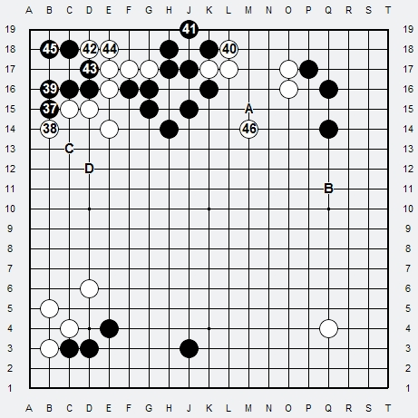

# Ex.2 Groupes instables

1. Noir approche le Komoku blanc au Sud en Tobi sur 4ème ligne
2. Blanc joue le joseki haut, et prend une option bord Ouest
3. Noir demande le partage du coin par le Tsuke en dessous
4. Blanc accepte et bloque
5. Noir solidifie
6. Blanc sécurise sa base de vie
7. Noir a son tour concrétise sa base de vie

A Blanc de jouer. L'Échange est équitable (1-7 : joseki classique approche haute sur Komoku avec partage du coin Tobi-Keima-Tsuke Gote).

8. Blanc approche par le bord Nord-Est dans la sphère de Noir par un classique Keima
9. Noir répond par un shimari haut en Tobi
10. Blanc joue extension en Nikken-Tobi (1ère extension abandonnée car trop plate mais classique en 2ème extension)
11. Noir joue Tsuke : Contact !

QUESTION : Mais que cherche Noir ? En jouant contact il renforce Blanc, non ? Alors que veut-il ?

RÉPONSE : Noir veut une seule chose, passer en Mode Combat et déstabiliser Blanc !

***

Zone A
> Mais avant il doit se renforcer car il n'est pas assez solide (On joue au contact lorsque l'on veut se renforcer, on renforce aussi l'adversaire).
> Noir estime qu'il en sort avantageux car en même temps il concrétise sa base de vie (un peut courte mais haute, cela lui convient pour combattre),
> Blanc lui n'en a toujours pas. Lorsque l'on cherche a se renforcer, c'est pour passer en Mode Combat car pour combattre il faut être d'abord solide !

Zone B
> Noir veut le Sente a tout prix pour pouvoir attaquer Blanc, jouer Tsuke = réponse Nobi, Blanc n'ira donc pas jouer logiquement ailleurs.

12. Blanc joue Nobi (maintenant son extension est trop courte, l'extension classique a partir d'un Nobi est 3 espaces pour Base de vie !)
13. Noir pince et supprime la meilleure direction de base de vie a Blanc (voir le cours sur les Directions). Maintenant il peut faire courir Blanc, qui est instable pour concrétiser des territoires en A ou/et B

14. Blanc contre-attaque en contre-pincant, mais est-il assez fort pour combattre ? non !
Noir lui l'est maintenant grâce au Tsuke, et le Hoshi est stable au Nord-Ouest
15. Noir sort en Tobi et coupe Blanc en deux !
16. Blanc cherche a connecter en voulant couvrir Noir mais la séquence ne fonctionne pas a cause du Tobi Noir
17. Noir joue Tsuke pour couper définitivement ou tuer la pierre blanche et stabiliser

Blanc aurait du stabiliser en jouant A au lieu de jouer C, et laisser ses pierres 14 et 16 en l'état, quitte a revenir ensuite, en jouant B par exemple, pour mieux réduire le Nord-Ouest Noir.

***

18. Blanc coupe
19. Noir atari
20. Blanc atari pour fermer
21. Noir connecte
22. Blanc ferme
23. Noir coupe (crée les aji A et B pour tuer, et ainsi réunir et stabiliser ses trois groupes Nord)

24. Blanc veut sauver sa pierre bord B (Noir alors tue A)
25. Noir pousse et menace de nouveau de tuer 24-B (il a besoin de pousser pour conclure)
26. Blanc pousse a son tour
27. Noir atari sur A et tue en Shicho (le shicho est favorable pour Noir sur bord Ouest)
28. Blanc sort...
29. Noir atari...

A Blanc de jouer. Les trois groupes noirs sont connectés. Blanc est déchiré, le groupe droit n'a toujours pas de base de vie et reste instable.

***

30. Blanc pousse
31. Noir tue les pierres de coupe
32. Blanc Hane
33. Noir pousse
34. Blanc pousse aussi
35. Noir prend le coin (il aurait pu couper en E15 pour tuer soit le bord soit l'extérieur)
36. Blanc protège la coupe

37. Noir Hane
38. Blanc bloque
39. Noir connecte
40. Blanc atari
41. Noir mange
42. Blanc Tsuke
43. Noir forme un oeil et menace la pierre 42
44. Blanc connecte
45. Noir finalise ses 2 yeux
46. Blanc enfin sort son groupe Nord-Est

La partie est toujours équilibrée mais a Noir de jouer, Il peut toujours faire courir le groupe blanc et jouer A, non pas pour fermer, mais pour menacer de tuer les yeux et garder l'instabilité de Blanc. Ensuite il restera a faire courir Blanc pour mieux commencer a concrétiser en B.
Noir peut aussi jouer le Kikashi en C, puis un Kosumi en D pour soit prendre du bord Ouest, soit tout réduire le Centre

## Bilan en Fin de Fuseki

Noir est passé très tôt en combat pour rendre le groupe blanc Nord instable, et avoir un point d'appui afin de se créer opportunités et prendre l'avantage. Blanc a ignoré l'Urgence et Priorité au Fuseki : La Base de vie en ayant qu'une seule direction possible pour concrétiser celle-ci.