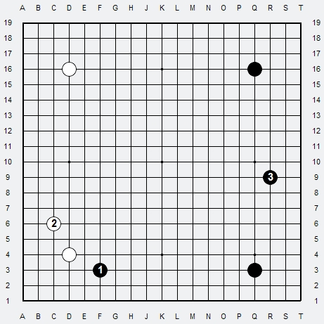
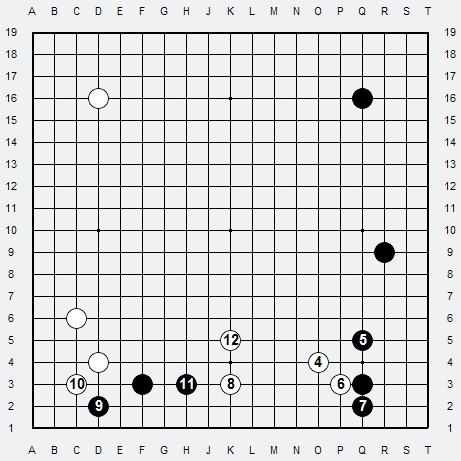
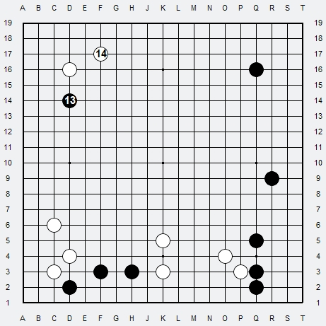
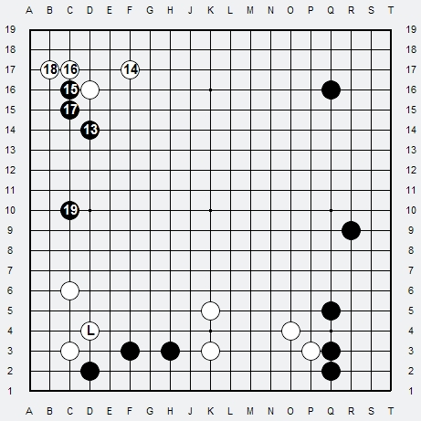
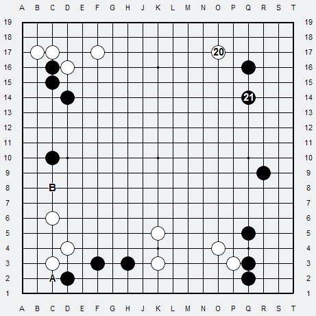
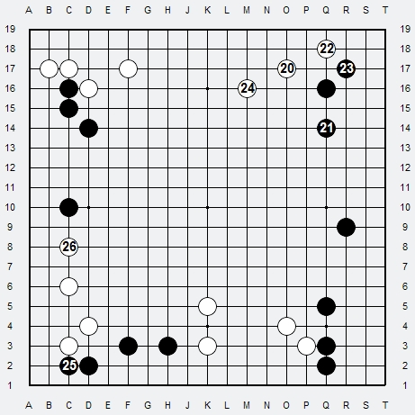
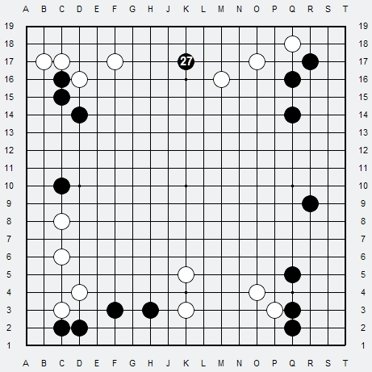
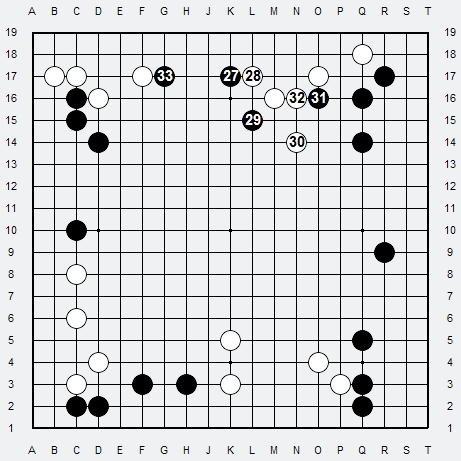

# Ex.3 Groupes Solides

1. Noir préfère approcher de suite le Hoshi blanc Sud-Ouest en Keima plutôt que de verrouiller son Komoku Sud-Est
2. Blanc joue classiquement le Keima pour le coin
3. Noir ne répond pas et joue ailleurs, en créant un Fuseki Chinois

QUESTION : Mais Noir peut-il se permettre de jouer ainsi et ne pas s'occuper de sa base de vie ? Bizarre non ? Comment Blanc peut-il jouer ?

Blanc a deux choix :

- Sanctionner la non-réponse de Noir et menacer directement la pierre Sud laissée toute seule
- Attendre pour la pierre Sud et répondre des a présent à Noir et à son Fuseki Chinois

RÉPONSE : Le choix est simple :

- la pierre noire Sud peut attendre puisque Noir n'y a pas encore jouer, et de plus ne représente pas encore bcp
- Réduire dès à présent le développement du Fuseki Chinois noir lui ne peut pas attendre car c'est beaucoup !

Cependant puisque en général on approche le Fuseki chinois par le Komoku qui est ici aussi au Sud, Blanc va trouver une séquence pour les deux : approcher le Fuseki Chinois et casser l'aile Sud, et peser sur le pierre Sud.

4. Blanc approche le Komoku noir par un classique Keima
5. Noir verrouille le coin classiquement par un Tobi
6. Blanc joue contact ! D'abord pour se renforcer, et menacer l'invasion derrière le Tobi, et en même temps prendre appui pour la fermeture bord
7. Noir descend, il ferme le coin et se crée une possibilité de réduction ultérieure sur le bord Sud
8. Blanc joue extension a distance de la pierre noire Sud, la menace et forme son option de base de vie
9. Noir est obligé de répondre, et va chercher de la base de vie dans le coin Sud-Ouest
10. Blanc lui refuse la base de vie au San-san pour maintenir la pression, et en même temps protège sa propre base de vie
11. Noir alors s'étend en Tobi sur le bord et stabilise sa base de vie
12. Blanc Sud se retrouve menacé des deux cotés, il sort pour peser sur le centre, et avoir plus de potentiel pour un éventuel 2ème oeil si besoin est

A Noir de jouer.

Les quatre groupes au Sud ont fait leur travail, ils sont solides, stables avec une base de vie.
La partie est quasiment équilibrée, aucun problème latent n'existe sur le Goban.

***

13. Noir décide plutôt d'approcher le Nord assez haut vers le Centre donc 4ème ligne et par l'Ouest
14. Blanc répond classiquement en Keima

15. Noir choisit un joseki que l'on connait surtout pour le Komoku, afin de bien s'étendre sur le bord Ouest
16. Blanc défend immédiatement sa base de vie et bloque
17. Noir se solidifie
18. Blanc prend le coin et sa base de vie
19. Noir s'étend sur le bord Ouest et prend sa base de vie en se rapprochant du groupe blanc Sud-Ouest

A Blanc de jouer. Les deux groupes Nord sont bien stables maintenant.
(13-19 : joseki classique approche haute sur Hoshi avec partage du coin Tobi-Keima-Tsuke Gote)

QUESTION : Mais Le Groupe Blanc Sud-Ouest L est-il en danger ?

RÉPONSE : Non. Car si jamais Noir décide de pousser dans le coin Sud-Ouest en A, Blanc étend sa base de vie sur le bord en B, si Noir s'étend en B, alors Blanc étend quand même sa base de vie en A, dans les deux cas sa base de vie n'est pas menacée. 

***

Blanc peut donc aller jouer ailleurs.

20. Blanc approche simplement le Hoshi noir Nord-Est en Keima
21. Noir répond classiquement en Tobi

22. Blanc prend une option base de vie dans le coin
23. Noir ne lui laisse pas le San-San et y joue
24. Blanc s'étend alors pour stabiliser sa base de vie sur le bord Nord en Keima
25. Noir décide de stabiliser un peu plus son groupe Sud en Sente
26. Blanc répond obligatoirement pour sa propre base de vie

A Noir de jouer. La partie reste équilibrée pour les deux joueurs avec un très léger avantage pour Noir, à cause de son Fuseki Chinois (20-24 : joseki classique approche basse sur Hoshi avec partage du coin Keima-Tobi-Keima Gote)

***

27. Noir rentre au Nord pour tenter de couvrir Blanc et fermer le Nord-Est

28. Blanc répond classiquement Tsuke
29. Noir joue Keima pour une double possibilité Extension ou Fermeture du Nord
30. Blanc sort vers le Centre en Keima (le plus important pour éviter du potentiel Noir Centre)
31. Noir se solidifie et menace de nouveau de fermer
32. Blanc connecte et maintient sa sortie vers le Centre
33. Noir commence à construire au Nord

La partie est toujours équilibrée avec un très léger avantage pour Noir.

## Bilan en Fin de Fuseki

Tous les groupes sont stables, chacun des deux joueurs peut se consacrer pleinement a son plan général sans avoir a régler d'autres problèmes :

- Noir va vouloir développer son groupe Nord et prendre le Centre avec en soutien son groupes Nord-Est
- Blanc va contester grâce a ses groupe Nord. Le Combat s'annonce très serré pour le Centre, car tous les groupes du Goban sont solides avec une base de vie.
